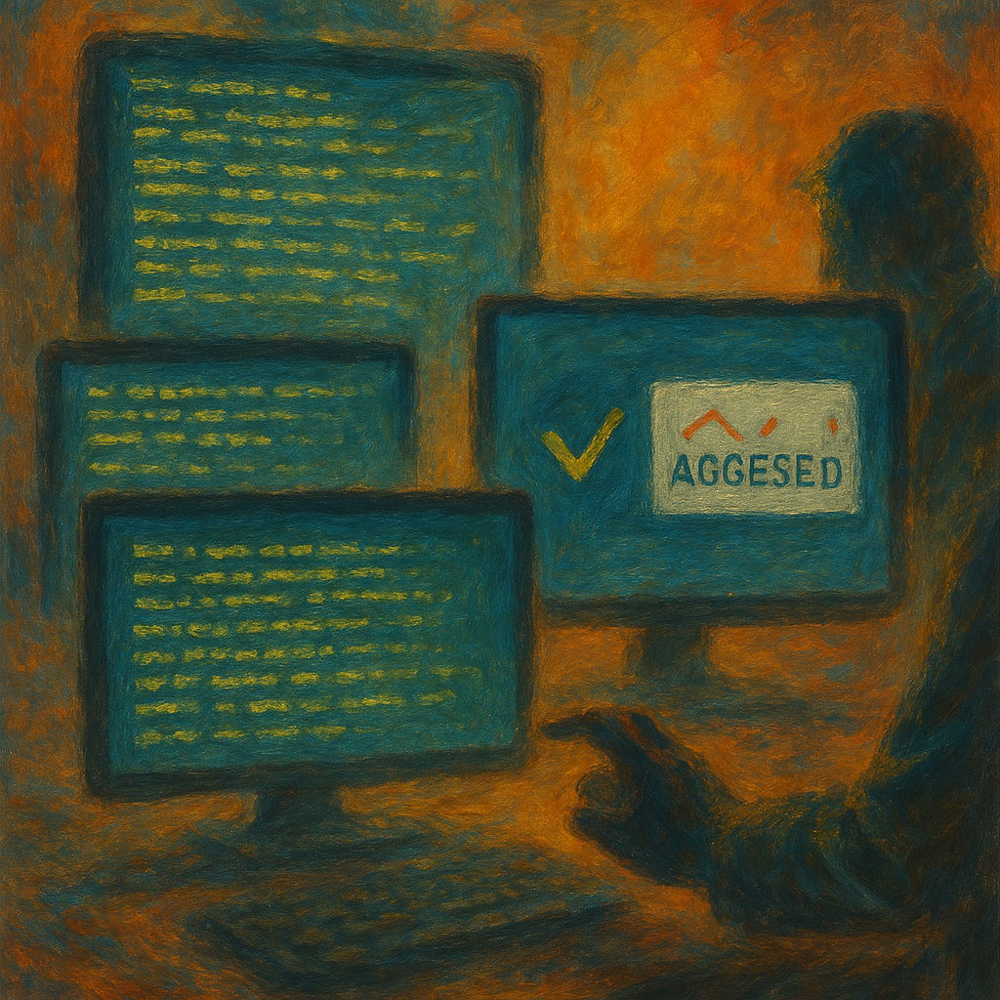

# Beyond Watermarks: How Steganographic Signatures Are Revolutionizing Content Protection

*Exploring [K2-Sonnet's](https://github.com/K2/Stylometrics) innovative approach to digital rights management, content attribution, and DLP without compromising user experience*

## The Invisible Guardian of Digital Content

In today's digital ecosystem, content moves at the speed of light—copied, shared, remixed, and repurposed across platforms. For creators, publishers, and enterprises, a critical question emerges: How do you maintain attribution and protect digital rights when content can be effortlessly copied and pasted?

Traditional solutions like visible watermarks degrade user experience, while basic metadata is easily stripped away. Enter the [K2-Sonnet project's](https://github.com/K2/Stylometrics) steganographic signature system—a groundbreaking approach that embeds ownership information and signatures directly into content itself, invisible to human readers but cryptographically verifiable.

## Three-Layer Steganography: The Technical Breakthrough

What makes the K2-Sonnet approach revolutionary is its multi-layered steganographic system, designed to survive even the most aggressive content transformations:

### Layer 1: Zero-Width Character Encoding

The primary encoding layer uses zero-width Unicode characters (ZWSP, ZWNJ, ZWJ) strategically placed within text. These characters:

- Are completely invisible when displayed
- Don't affect rendering or copy/paste functionality
- Can encode arbitrary metadata including creator information, timestamps, and signatures
- Support cryptographic verification against public keys

### Layer 2: Stylometric Pattern Encoding

The secondary layer—truly innovative—encodes information through subtle linguistic patterns:

- Manipulates sentence endings (period vs. exclamation/question marks)
- Strategically places or removes adverbs
- Varies paragraph structures
- Creates natural-looking style variations that encode binary data

This provides resilience against content processing that might strip special characters, ensuring attribution persists even when content is reformatted, simplified, or processed through text-only systems.

### Layer 3: Structural Encoding

The third and most resilient layer—representing a breakthrough in steganographic persistence—operates at the narrative structure level:

- Encodes data through point-of-view shifts (first-person vs. third-person narrative)
- Uses rhetorical patterns (questions vs. emphatic statements)
- Modifies paragraph length patterns (alternating short-long vs. consistent medium)
- Employs dialectic structures (argumentative, descriptive, narrative)
- Preserves metadata through paraphrasing and even translation

This highest-order encoding ensures metadata "stickiness" across multiple generations of content transformation, making it virtually impossible to remove attribution without destroying the content's fundamental meaning.

## Real-World Applications

### 1. Enterprise DLP (Data Loss Prevention)

For organizations handling sensitive information, the system enables:

- **Exfiltration Tracing**: Track the source of leaked documents back to specific users
- **Context Persistence**: Maintain classification metadata within content even when copied outside secure systems
- **Post-Breach Attribution**: Identify which documents were compromised and from which systems

### 2. Digital Rights Management for Creators

Content creators benefit from:

- **Invisible Attribution**: Maintain creator information without watermarks
- **Licensing Verification**: Embed license terms directly in content
- **Usage Analytics**: Track how content spreads across platforms
- **Provenance Verification**: Prove ownership of original works

### 3. AI Content Attribution

As AI-generated content becomes ubiquitous:

- **Source Identification**: Trace content back to specific AI systems or providers
- **Generation Parameters**: Embed model settings and context information
- **Human Oversight**: Record human reviewers who approved content
- **Safety Compliance**: Verify content passed safety filters before distribution

## Beyond Current Watermarking: A Fundamental Shift

Traditional watermarking approaches face significant limitations:

| Traditional Approaches | K2-Sonnet Solution |
|------------------------|-------------------|
| Visible watermarks degrade experience | Completely invisible to humans |
| Metadata easily stripped | Multi-layer redundancy ensures persistence |
| Single point of failure | Triple-encoding approach provides maximum resilience |
| Limited to specific formats | Works with plain text - the universal format |
| Detectable by automated systems | Stylometric approach mimics natural language |
| Lost through content transformation | Structural encoding survives paraphrasing and translation |

## Cryptographic Verification: The Security Foundation

What transforms this from mere steganography into a robust attribution system is its cryptographic foundation:

This creates a complete chain of custody:

1. Content creation with embedded metadata
2. Cryptographic signing to prevent tampering
3. Distribution through any channel
4. Extraction and verification by authorized parties
5. Attribution to original source with cryptographic certainty

## The Privacy-Preserving Edge

Unlike many tracking technologies, this system:

- Doesn't require online verification
- Operates independently of network connections
- Functions without cookies or client-side scripts
- Works across airgaps and offline environments
- Provides plausible deniability through its invisible nature

## Implementation Example: Content Security Pipeline

Here's a simplified view of how organizations are implementing this technology:

1. **Content Creation**: Author creates document
2. **Metadata Injection**: System embeds creator, timestamp, classification, and other metadata
3. **Multi-Layer Encoding**: Content processed through zero-width, stylometric, and structural encoders
4. **Signature Application**: Content is cryptographically signed
5. **Distribution**: Content flows through normal channels
6. **Verification Points**: Strategic scanning at security boundaries
7. **Attribution Lookup**: If leaked content is discovered, verification against key database

## The Future of Digital Rights Protection

The implications extend far beyond current use cases:

- **Cross-Platform Persistence**: Attribution that survives across social media, messaging, and document systems
- **Content Supply Chain Security**: Tracking information flow through complex publishing pipelines
- **Licensing Automation**: Smart contracts that verify embedded rights information
- **Decentralized Attribution**: Public verification without central authorities
- **Cross-Generation Tracking**: Following content through multiple transformations, translations, and adaptations

## Conclusion: Invisible But Unbreakable

The [K2-Sonnet steganographic signature system](https://github.com/K2/Stylometrics) represents a fundamental shift in how we think about digital content protection. By embedding attribution that's invisible to humans but cryptographically verifiable, we're creating a world where:

- Creators receive proper attribution without degrading user experience
- Organizations protect sensitive information with robust tracing capabilities
- Content maintains its provenance even as it flows across platforms and formats

As digital content continues to proliferate, technologies like this become not just helpful but essential for maintaining trust, accountability, and proper rights management in our information ecosystem.

---

*This post was written with contributions from the creator of K2-Sonnet. Interested in implementing this technology in your organization? [Contact us](https://github.com/K2/Stylometrics) for a consultation on how K2-Sonnet can revolutionize your content protection strategy. View the [open-source implementation on GitHub](https://github.com/K2/Stylometrics).*

*Disclaimer: While Claude AI from Anthropic was used to assist in researching and developing aspects of this technology, this project and its documentation were created independently and have not been reviewed, endorsed, or supervised by Anthropic. Any technical implementations, opinions, or claims presented are solely those of the project contributors and do not represent Anthropic's official position or recommendations.*